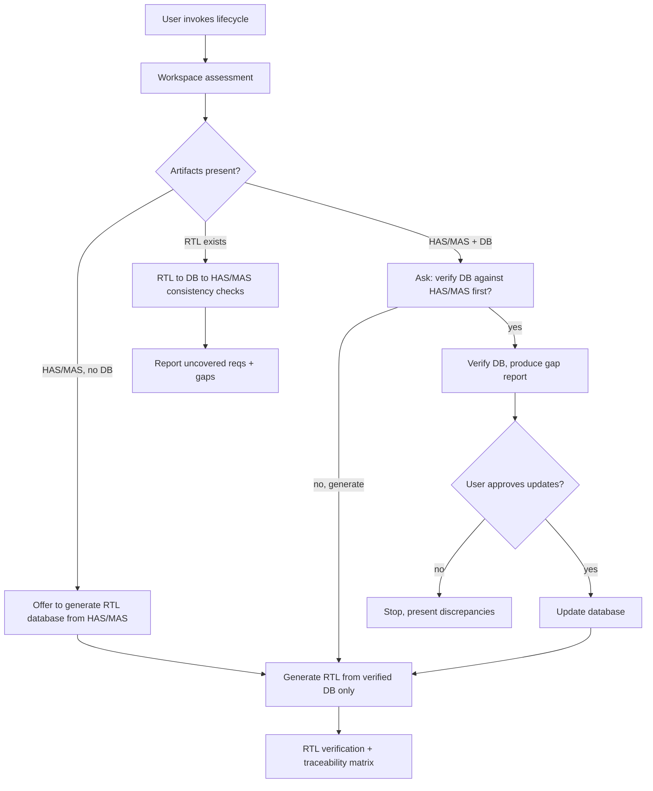

# RTL Development & Verification lifecycle

Use this workflow when the user's intent is **lifecycle** (requirements, RTL database, traceability, gap analysis, generate-from-spec, or verify-against-spec) — see [topic-router.md](topic-router.md) for intent detection. For pure coding/review prompts, use [design-workflow.md](design-workflow.md) / [review-checklist.md](review-checklist.md) instead.

This workflow **gates RTL generation on a validated RTL database** and keeps full traceability between HAS/MAS requirements, the database, RTL, and verification artifacts.

> Conduct rule: never invent requirements, ports, addresses, clocks, resets, or paths. Read coding guidelines from `docs/standards/`. Ask the user when in doubt. See [rtl-design-conduct.mdc](../../rules/rtl-design-conduct.mdc).

## 0. Sources

- Coding guidelines: `docs/standards/` (load only topic-matched files via [topic-router.md](topic-router.md)).
- RTL database schema: [docs/standards/rtl-database-schema.md](../../../docs/standards/rtl-database-schema.md).
- Templates: [templates/rtl-db/](../../../templates/rtl-db/) (YAML DB + JSON Schema + report skeletons) and [templates/project-layout/](../../../templates/project-layout/) (new-project scaffold).

## 1. Workspace assessment

Detect which artifacts are present **in the target project** (do not assume locations — if `rtl_db/index.yaml` exists, read its `paths:` block first):

| Artifact | How detected |
|----------|--------------|
| HAS documents | `paths.has_dir` or user-named files |
| MAS documents | `paths.mas_dir` or user-named files |
| RTL database | `rtl_db/` with `index.yaml` + YAML files |
| Existing RTL | `paths.rtl_dir` (`.v` / `.sv`) |
| Register sources | `paths.register_sources` (SystemRDL `.rdl` / IP-XACT `.xml`) |
| Coding standards / architecture | project docs or this package's `docs/standards/` |
| Lint / verification reports | user-named or `paths.reports_dir` |

Classify project state:

- **New Project** — no RTL database, little/no RTL. Offer to scaffold the layout (step 2) and generate the database from HAS/MAS.
- **Partial Project** — some artifacts (e.g. HAS/MAS + partial RTL, no database). Detect existing locations; do not force a layout.
- **Existing RTL Project** — RTL present (with or without database). Focus on RTL <-> database <-> HAS/MAS consistency.

Report the detected artifacts and the classification before proceeding.

## 2. Project scaffold (New Project only — ask first)

On a **New Project**, offer (do not force) the recommended layout from [templates/project-layout/](../../../templates/project-layout/):

```text
docs/has/   docs/mas/   regs/   rtl/   rtl_db/
```

- Ask before creating folders; never overwrite existing content.
- Copy the placeholder `README` files so users know what to add where.
- Initialize `rtl_db/index.yaml` with a `paths:` block.

For **Partial / Existing** projects: do **not** scaffold. Detect the real locations and record them in `rtl_db/index.yaml` `paths:` (no file moves).

## 3. Requirement analysis

- Extract requirements from HAS/MAS (only from provided documents — never invent).
- Identify and categorize: modules, interfaces, registers, memories, clocks, resets, parameters, protocols, constraints.
- Build the structured requirement model per [rtl-database-schema.md](../../../docs/standards/rtl-database-schema.md) (`requirements.yaml`).
- Flag anything missing/ambiguous as `TBD` and surface it as a question rather than guessing.
- Output: **Requirement extraction report** (`reports/requirement-extraction-report.md`).

## 4. RTL database management

- **Create** database entries from HAS/MAS when no database exists (`requirements.yaml`, `modules.yaml`, `register_map.yaml`, `traceability.yaml`, `index.yaml`).
- **Update** the database when requirements change (preserve stable IDs; mark obsolete entries, do not silently delete).
- **Registers:** do not redefine fields in YAML. `register_map.yaml` only *indexes* SystemRDL/IP-XACT sources (`block_name`, `source_type`, `source_file`, `base_offset`, `traces_to`); read field/access detail from the source on demand.
- Maintain traceability links in `traceability.yaml` as entries are added.
- Validate every YAML against its JSON Schema (`rtl_db/schema/*.schema.json`).

## 5. RTL database verification (gap analysis)

Run when the user requests verification (see decision flow). Compare the database against HAS/MAS and identify:

- **Missing entries** — requirements with no database entry.
- **Obsolete entries** — database entries with no backing requirement.
- **Incorrect mappings** — entries that trace to the wrong requirement/element.
- **Ambiguous requirements** — requirements that cannot be deterministically mapped.

Output: **Gap analysis report** (`reports/gap-analysis-report.md`). Update the database only after user approval.

## 6. RTL generation (gated)

Generate RTL **only after database validation**.

- Produce an **RTL generation plan** (`reports/rtl-generation-plan.md`) first: which modules/elements, which requirements they satisfy, reuse vs new.
- **Reuse existing RTL** where possible; avoid generating duplicate functionality.
- For register logic, generate from the **SystemRDL/IP-XACT** toolchain/source rather than bespoke RTL (ask IP-vs-custom and library-macro questions per the conduct rule).
- Follow coding standards and architecture guidelines via the existing [topic-router.md](topic-router.md) (FSM, CDC, clocks/resets, lint, dialect, etc.).
- Record generated files and their requirement links in `traceability.yaml`.

## 7. RTL verification & traceability

- Verify RTL against the RTL database (entries implemented as specified).
- Verify RTL against HAS/MAS requirements (full coverage).
- Generate a **traceability matrix** (`reports/traceability-matrix.md`): requirement <-> database entry <-> RTL <-> verification artifact.
- Report uncovered requirements and implementation gaps.
- Output: **RTL verification report** (`reports/rtl-verification-report.md`).

## Decision flow



## User interaction rules

1. If HAS/MAS **and** RTL database are both present — **ask** whether RTL database verification should run before RTL generation.
2. If the RTL database is missing — **offer** to generate it from HAS/MAS.
3. If requirements and RTL disagree — **stop generation** and present discrepancies.
4. Never assume missing information; ask instead.
5. Generate RTL only from a verified database.
6. Update the database only after user approval of the gap report.
7. Separate **facts** (HAS/MAS, standards, RTL in workspace) from **recommendations**, and state which sources were used.

## Outputs (summary)

| Output | File |
|--------|------|
| Requirement extraction report | `rtl_db/reports/requirement-extraction-report.md` |
| RTL database | `rtl_db/*.yaml` |
| Gap analysis report | `rtl_db/reports/gap-analysis-report.md` |
| Traceability matrix | `rtl_db/reports/traceability-matrix.md` |
| RTL generation plan | `rtl_db/reports/rtl-generation-plan.md` |
| RTL source code | project `rtl/` (gated) |
| RTL verification report | `rtl_db/reports/rtl-verification-report.md` |

Always prioritize correctness, traceability, and requirement coverage over generation speed.
